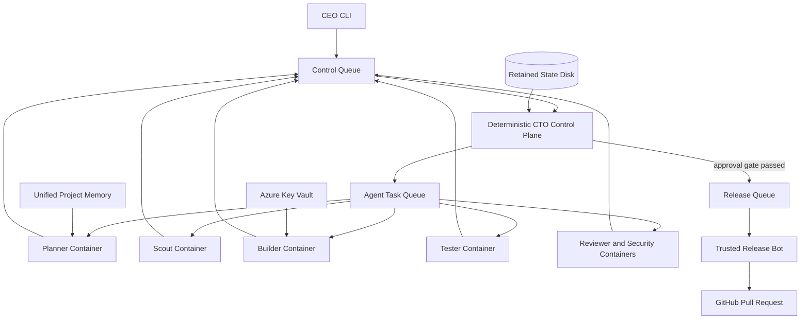

# Factory AI

<div align="center">

**A durable, private coding organization that runs in your cloud.**

One CEO interface. A deterministic CTO. Isolated specialist agents. Reviewed pull requests.

[](https://github.com/itsvedantkumar/factory-ai/actions/workflows/ci.yml)
[](https://nodejs.org/)
[](https://azure.microsoft.com/)
[](LICENSE)

</div>

## Why Factory AI?

Most coding-agent setups are interactive sessions pretending to be infrastructure. Factory AI is an actual delivery system:

- Objectives survive terminal closures, model interruptions, VM reboots, and worker crashes.
- The orchestrator cannot edit code, execute shell commands, access model credentials, or publish releases.
- Every task runs in a bounded, disposable container and isolated Git branch.
- Tester, reviewer, and security agents must approve before the trusted release bot opens a PR.
- Project memory, queue state, costs, logs, and hourly progress remain visible from one CLI.

## Quick Start

Requirements: Node.js 20, [Azure CLI](https://learn.microsoft.com/cli/azure/install-azure-cli), [GitHub CLI](https://cli.github.com/), `az login`, and `gh auth login`.

```bash
npm install -g factory-ai
factory setup
```

The arrow-key wizard handles the rest. A GitHub organization is not required; personal repositories work by default.

1. Select Azure AI Foundry, AWS Bedrock, or hybrid routing.
2. Select infrastructure region and optional GitHub Enterprise organization.
3. Enter provider credentials through hidden prompts.
4. Let the installer create Azure infrastructure, Key Vault secrets, model routing, and supervised services.
5. Start shipping.

```bash
factory init ~/Projects/my-app
factory submit MY_ORG/my-app "/goal ship authenticated health checks"
factory ui
```

## Operator Experience

```text
╔═ FACTORY AI ════════════════════════════════════════════════╗
  Worker active · queue 0 · DLQ 0 · Azure MTD INR 16,068.56
  Objectives complete:12 running:2 failed:1

  [running] Add authenticated health checks
    succeeded  scout     GPT-5.4 nano  · inspect conventions
    running    builder   GPT-5.6       · implement contract
    blocked    tester    GPT-5.4       · verify behavior
    blocked    reviewer  GPT-5.6       · review correctness
    blocked    security  GPT-5.6       · assess boundaries
    blocked    release   GPT-5.6       · publish reviewed PR
╚══════════════════════════════════════════════════════════════╝
```

| Command | Purpose |
| --- | --- |
| `factory setup` | Interactive cloud/provider installation |
| `factory ui` | Full-screen interactive admin console |
| `factory submit OWNER/REPO "OBJECTIVE"` | Send one CEO objective |
| `factory issue OWNER/REPO NUMBER` | Turn a GitHub issue into a tracked objective |
| `factory telegram configure` | Configure allowlisted Telegram remote intake |
| `factory dashboard` | Objectives, agents, models, queue, DLQ, and Azure cost |
| `factory init PATH` | Create durable repo-local project context |
| `factory doctor` | Services, storage, memory, and host health |
| `factory queue` | Queue and dead-letter depth |
| `factory logs` | Consolidated service logs |
| `factory report` | Latest hourly executive report |
| `factory pause` / `resume` | Pause or resume execution safely |
| `factory secret set NAME` | Store a credential in global Key Vault |
| `factory github connect ORG` | Connect GitHub Enterprise credentials |

## Architecture



The CTO is deliberately capability-free. It stores state, validates DAGs, dispatches tasks, and enforces gates. Model calls, Git workspaces, shell tools, MCP servers, and release credentials live behind separate trust boundaries.

See [ARCHITECTURE.md](ARCHITECTURE.md) for details.

## Model Routing

Defaults are evidence-based and role-specific:

| Role | Default | Rationale |
| --- | --- | --- |
| Scout | GPT-5.4 nano | Low-cost search and repository inspection |
| Simple builder task | Kimi K2.7-Code | Economy coding path, independently reviewed |
| Complex/unspecified builder task | GPT-5.6 | Fail-safe implementation default |
| Tester | GPT-5.4 | Independent behavioral verification |
| Planner, debugger, reviewer, security, release | GPT-5.6 | Higher-judgment work |

Any role can be overridden with an Azure deployment or `bedrock/MODEL_ID`. Bedrock uses the Converse tool API behind the same sandbox and approval gates.

## Reliability

- Azure Service Bus peek-lock delivery, duplicate detection, retries, and dead letters
- systemd restart supervision and reboot recovery
- Atomic objective state on a retained Premium SSD
- One self-contained clone and branch per task
- Continuous trusted Git checkpoint pushes
- Bounded model steps, execution time, output, CPU, memory, and PIDs
- Permanent failures become explicit objective results instead of stale tasks
- Hourly durable executive reports

The production smoke suite has verified worker `SIGKILL`, message redelivery, reboot persistence, gated PR publication, and content-filter failure handling.

## Memory and Skills

Every repository gets two memory layers:

- Deterministic project events injected into future planner context
- Pinned MCP knowledge-graph memory on retained storage

Built-in progressive skills include `/goal`, `/loop`, project context, systematic debugging, TDD, verification, security review, dependency security, browser verification, release discipline, and token efficiency. Context7 and Playwright MCPs are pinned and role-scoped.

Use `factory init PATH` to create `.agent-factory/` project, architecture, commands, decisions, risks, and handoff files without overwriting existing context.

## Credentials

Credentials never belong in repository `.env` files. Store them globally:

```bash
factory secret set SERVICE-API-KEY
factory secret list
factory secret copy SERVICE-API-KEY
```

Values are held in Azure Key Vault, loaded into trusted process memory, and passed only to role-required containers. Secret values are never displayed by the CLI.

## GitHub Enterprise

GitHub Enterprise Cloud continues to use `github.com`:

```bash
gh auth refresh -h github.com -s admin:org,repo,workflow,read:org
factory github status
factory github connect YOUR_ORG
factory github transfer OWNER/REPO YOUR_ORG
```

Organization rulesets can then enforce private-repo status checks, reviews, and auto-merge.

## Telegram Remote Control

Create a bot with `@BotFather`, obtain your numeric chat ID, then run:

```bash
factory telegram configure
```

Only explicitly allowlisted chat IDs are accepted. Supported commands:

```text
/submit OWNER/REPO objective
/goal OWNER/REPO objective
/loop OWNER/REPO objective
/status
/help
```

Telegram cannot run shell commands, read secrets, modify release policy, or bypass review gates. Durable update offsets prevent duplicate objectives after restarts.

## Security

- No VM public IP or inbound network path
- Stable outbound-only NAT
- Managed identity and RBAC
- Subnet-restricted Key Vault
- Trusted Launch, Secure Boot, and vTPM
- Read-only worker image, dropped capabilities, `no-new-privileges`, and no Docker socket
- GitHub publication isolated from model-controlled containers
- Pinned dependencies, MCPs, skills, and runtime revisions
- CI, Dependabot, npm audit, Trivy vulnerability/secret/misconfiguration scans

Read [SECURITY.md](SECURITY.md) before adding tools, providers, or permissions.

## Development

```bash
git clone https://github.com/itsvedantkumar/factory-ai.git
cd factory-ai
npm ci
npm run check
npm run lint
npm test
npm audit --audit-level=high
az bicep build --file infra/main.bicep --stdout >/dev/null
bash -n bootstrap/setup.sh bootstrap/deploy-runtime.sh bin/factory
npm pack --dry-run
```

## Documentation

| Document | Purpose |
| --- | --- |
| [ARCHITECTURE.md](ARCHITECTURE.md) | Runtime, boundaries, and data flow |
| [RUNBOOK.md](RUNBOOK.md) | Operations, recovery, and cost control |
| [SECURITY.md](SECURITY.md) | Security policy and extension rules |
| [CONTRIBUTING.md](CONTRIBUTING.md) | Development and verification contract |
| [HANDOFF.md](HANDOFF.md) | Team/friend transfer context |
| [docs/COMPARISON.md](docs/COMPARISON.md) | Honest comparison with paid alternatives |
| [ROADMAP.md](ROADMAP.md) | Planned platform and ecosystem work |
| [GOVERNANCE.md](GOVERNANCE.md) | Decision and release governance |
| [SUPPORT.md](SUPPORT.md) | Community support process |
| [CODE_OF_CONDUCT.md](CODE_OF_CONDUCT.md) | Community standards |

## Current Limitations

- Azure Cost Management data is authoritative but delayed.
- Private-repo auto-merge requires an eligible GitHub Team/Enterprise organization policy.
- Kimi is used only for explicitly simple coding tasks until broader evaluations justify expansion.
- npm releases are verified and published with provenance through GitHub Actions.

## License

[MIT](LICENSE)
